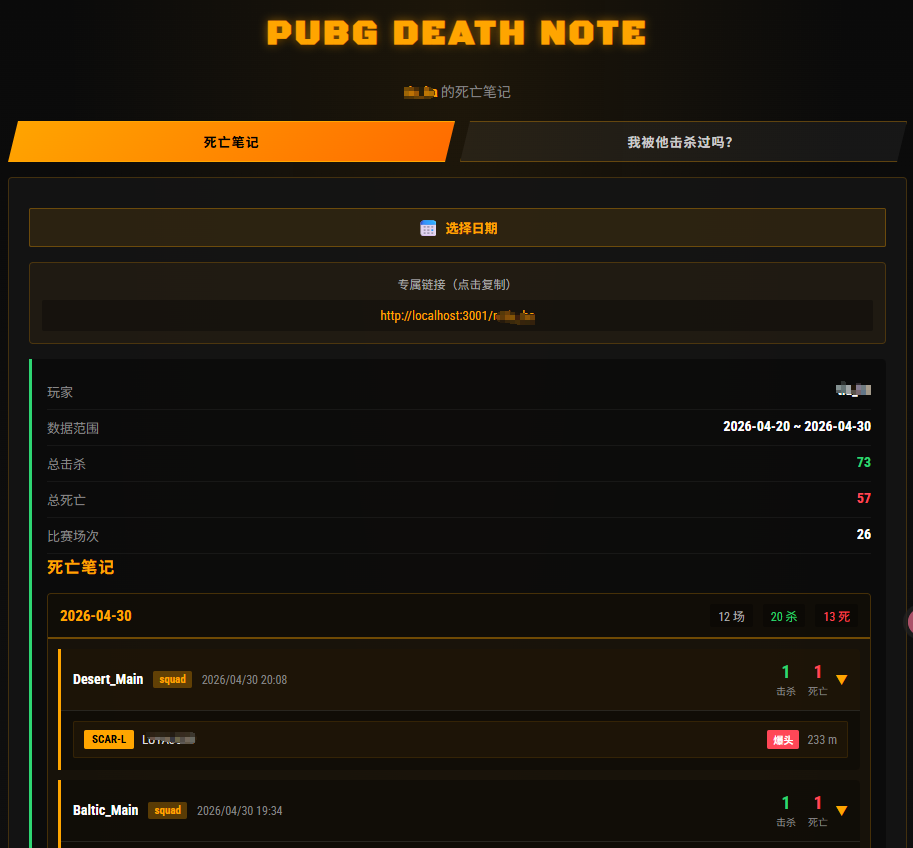

# PUBG Death Note

> **你的 PUBG 专属"死亡笔记"——记录每一场对局中的每一次击杀。**

## 项目亮点

**不只是查询击杀记录，还能反向验证：** 支持在已有死亡笔记记录中，查询某个玩家是否曾被击杀过。输入对方昵称，一键查看你被击杀的时间、对局和详细经过。

## 客户端界面



## 功能特性

- **死亡笔记生成**：自动拉取并解析 PUBG 玩家对局数据，生成完整的击杀记录汇总
- **每日增量更新**：支持断点续传，每天自动补充新对局数据
- **反向击杀查询**：在已有记录中查询自己是否被某个玩家击杀过
- **专属分享链接**：每个玩家拥有专属链接，一键复制分享给好友，随时查看自己的死亡笔记
- **日历视图**：按日期浏览击杀记录，快速定位特定对局
- **管理后台**：任务管理、数据同步、死亡笔记生成与列表查看

## 环境要求

- Node.js >= 20
- npm >= 10
- （可选）Docker & Docker Compose

## 快速开始

### 本地开发

```bash
# 1. 安装依赖
npm install

# 2. 配置环境变量
cp .env.example .env
# 编辑 .env，填入你的 PUBG_API_KEY_1

# 3. 初始化数据库
npx prisma migrate deploy

# 4. 启动服务
npm run start:dev
```

启动后访问：
- 客户端: `http://localhost:3000/n/玩家昵称`
- 管理后台: `http://localhost:3000/admin/`

### Docker 部署

```bash
# 1. 配置环境变量
cp .env.example .env
vim .env  # 填入 PUBG_API_KEY_1

# 2. 构建并启动
docker compose build
docker compose up -d

# 3. 查看日志
docker compose logs -f
```

数据持久化在 `./data/`、`./logs/` 和 `./game-data/` 目录。

## 项目结构

```
├── src/
│   ├── main.ts                     # 应用入口
│   ├── common/                     # 共享工具
│   ├── config/                     # 环境变量验证
│   ├── constants.ts                # 全局常量
│   ├── death-note/                 # 客户端模块（查询、展示）
│   ├── prisma/                     # 数据库模块
│   ├── pubg/                       # 管理模块（API 调用、数据解析）
│   ├── scheduled-task/             # 定时任务
│   └── task/                       # 任务状态管理
├── public/                         # 静态前端资源
│   ├── index.html                  # 客户端页面
│   ├── css/style.css
│   ├── js/app.js
│   └── admin/                      # 管理后台
├── prisma/
│   ├── schema.prisma               # 数据库模型
│   └── migrations/                 # 数据库迁移
├── Dockerfile
├── docker-compose.yml
├── .env.example
└── clean.sh                        # 清理脚本
```

## API 接口

### 死亡笔记（客户端）

| 接口 | 说明 |
|------|------|
| `GET /api/v1/death-note/nickname/:nickname` | 获取用户死亡笔记状态 |
| `GET /api/v1/death-note/nickname/:nickname/matches?page=1&pageSize=10` | 分页获取死亡笔记（按天分组） |
| `GET /api/v1/death-note/nickname/:nickname/victim/:victimNickname` | **查询受害者被击杀记录** |
| `GET /api/v1/death-note/i18n/game-data` | 获取游戏数据翻译对照表 |

> 注：死亡笔记生成功能已移至管理后台，客户端不再提供生成接口。

### 对局管理

| 接口 | 说明 |
|------|------|
| `GET /api/v1/pubg/match/:matchId` | 获取对局详情 |
| `GET /api/v1/pubg/user/:nickname` | 搜索玩家 |

### 任务管理（管理后台）

| 接口 | 说明 |
|------|------|
| `GET /api/v1/pubg/tasks/list` | 获取任务列表 |
| `GET /api/v1/pubg/tasks/:taskId` | 获取任务状态 |
| `POST /api/v1/pubg/tasks/sync-local-matches` | 同步本地比赛数据 |
| `POST /api/v1/pubg/tasks/death-note/generate/:nickname` | 生成死亡笔记 |
| `POST /api/v1/pubg/tasks/death-note/force-generate/:nickname` | 强制重新生成死亡笔记 |
| `GET /api/v1/pubg/tasks/death-note/list` | 获取所有死亡笔记列表 |

## 环境变量

详见 [.env.example](.env.example)。

| 变量 | 必填 | 说明 |
|------|------|------|
| `PUBG_API_KEY_1` | ✅ | PUBG 开发者 API Key |
| `PUBG_API_KEY_2` | ❌ | 备用 API Key |
| `PUBG_API_KEY_3` | ❌ | 备用 API Key |
| `PUBG_API_REGION` | ❌ | API 区域，默认 `steam` |
| `DATABASE_URL` | ✅ | SQLite 路径 |
| `PORT` | ❌ | 服务端口，默认 `3000` |
| `LOG_LEVEL` | ❌ | 日志级别，默认 `info` |
| `CACHE_TTL` | ❌ | 缓存过期时间（秒），默认 `3600` |

## 常用命令

```bash
# 清理项目（编译产物、依赖、数据库、日志、游戏数据）
./clean.sh

# 重新安装依赖
npm install

# 初始化数据库
npx prisma migrate deploy

# 构建
npm run build

# 启动
npm run start:prod
```

## 许可证

UNLICENSED
